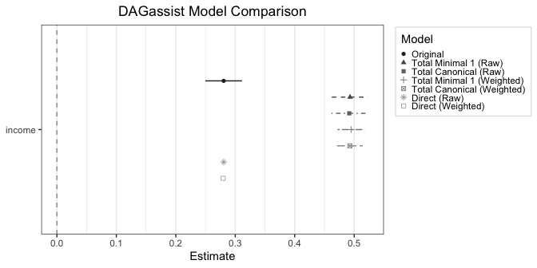

<!-- README.md is generated from README.Rmd. Please edit that file -->
```{r setup, include=FALSE}
knitr::opts_chunk$set(
  collapse = TRUE, 
  comment = "#>",
  fig.path = "man/figures/README-", out.width = "100%"
)

devtools::load_all(quiet = TRUE)
library(ggplot2)
library(dotwhisker)
```

```{r col, include=FALSE}
# make knitr treat output as plain text to pass r-comd-check
options(
  DAGassist.color = FALSE,  # we'll wire this up below
  crayon.enabled = FALSE
)
Sys.setenv(NO_COLOR = "1")
```

# DAGassist <a href='https://grahamgoff.com/DAGassist/'></a>
[](https://github.com/grahamgoff/DAGassist/actions/workflows/R-CMD-check.yaml)
[](https://github.com/grahamgoff/DAGassist/actions/workflows/pages/pages-build-deployment)
[](https://cran.r-project.org/package=DAGassist)
[](https://lifecycle.r-lib.org/articles/stages.html)
[](https://cran.r-project.org/package=DAGassist)

This R package enables researchers to align their regressions with their target estimands. The package provides tools for classifying DAG nodes by their causal roles, automating DAG-consistent re-estimation, and producing publication-grade diagnostic reports in LaTeX/Word/Excel/.md/.txt/dotwhisker. Uncertainty analysis functions allow researchers to check whether their conclusions survive uncertain edge directions or plausibly missing arrows.

---

## Installation Instructions

You can install `DAGassist` with:
```{r cran, eval=FALSE}
install.packages("DAGassist")
library(DAGassist) 
```

Or you can install the development version from GitHub with:

```{r install, eval = FALSE}
# install.packages("devtools")
devtools::install_github("grahamgoff/DAGassist")
```

## Getting Started

`DAGassist` is most useful at the analysis stage of the research process when researchers already have data and have conceptualized a data generating process. Before using `DAGassist`, create a DAG using `dagitty` or `ggdag`. Let's start with a canonical political science example: the effect of individual income on voter turnout. 

```{r ex-dag, echo=FALSE, message=FALSE, warning=FALSE}
library(dagitty)
library(ggdag)

x_pos <- c(
  turnout = 10,
  income = 0,
  state = 5,
  age  = 5,
  polint = 5,
  industry = 0,
  elect_comp = 10
)

y_pos <- c(
  turnout = 0,
  income = 0,
  state = 1,
  age  = -1,
  polint = 0.5,
  industry = -0.5,
  elect_comp = -0.5
)


dag_model <- dagify(
  
  turnout ~ income + state + age + polint + elect_comp,
  
  income ~ state + age + industry,
  
  polint ~ income,
  
  industry ~ age,
  
  exposure = "income",
  outcome  = "turnout",
  
  coords = list(x= x_pos, y = y_pos),

  labels = c(
    turnout = "Turnout",
    income = "Income",
    state = "State",
    age  = "Age",
    polint = "Political Interest",
    industry = "Industry",
    elect_comp = "Election Competitiveness"
  )
)

#coordinates for dag labels
label_df <- data.frame(
  name = c("turnout", "income", "state", "age", "polint", "industry", "elect_comp"),
  label_x = c(10, 0, 5, 5, 5, 0, 9),
  label_y = c(0, 0, 1, -1, 0.55, -0.5, -0.5)
)

# pull labels safely from dagitty object
labels_vec <- attr(dag_model, "labels")

label_df$label <- unname(labels_vec[label_df$name])

# ---- plot: ggdag without labels, then add manual labels
p <- ggdag_status(dag_model, text = FALSE) +
  theme_dag() +
  scale_fill_manual(values = c(exposure="black", outcome="grey30", none="grey90")) +
  scale_color_manual(values = c(exposure="black", outcome="grey30", none="grey60")) +
  theme(legend.position = "none") +
  geom_label(
    data = label_df,
    aes(x = label_x, y = label_y, label = label),
    inherit.aes = FALSE,   
    size = 3.4,
    label.size = 0.25
  )

p

```

```{r data, echo=FALSE}
set.seed(42)
n <- 5000

# exogenous
state <- rnorm(n)                                   
age <- rnorm(n)
elect_comp <- rnorm(n)                                  

# structural equations, following the DAG above
industry <- 0.50 * age + rnorm(n)                        
income <- 0.60 * state + 0.50 * age + 0.40 * industry + rnorm(n)
polint <- 0.50 * income + rnorm(n)                   
turnout <- 0.30 * income + 0.40 * polint +
            0.35 * state  + 0.25 * age +
            0.50 * elect_comp + rnorm(n)

df <- data.frame(turnout, income, state, age, polint, industry, elect_comp)
```

Simply provide a `dagitty()` object and a regression call and `DAGassist` will create a report classifying variables by causal role, and compare the specified regression to minimal and canonical models. 

```{r run}
DAGassist(dag = dag_model, 
          formula = lm(turnout ~ income + state + age + polint + industry + elect_comp, data = df),
          estimand = c("total", "direct")
)

```

DAGassist supports diagnostics across popular file formats:

The console output above is the same object rendered as text. The exports below were
produced by the same call, changing only `type =` and `out =`
(see [`dev/output_types.R`](dev/output_types.R)):

```{r type, eval=FALSE}
formats <- c(latex = "latex.tex",  word  = "word.docx",
             excel = "excel.xlsx", dotwhisker = "dw.png")

for (fmt in names(formats)) {
  DAGassist(dag      = dag_model,
            formula  = lm(turnout ~ income + state + age + polint + industry + elect_comp, data = df),
            estimand = "total",
            type     = fmt,
            out      = formats[[fmt]])
}
```
<table class="gallery"><tr>
<td><a href="man/figures/README-latex.png"></a><br><em>LaTeX (<code>tabularray</code>)</em></td>
<td><a href="man/figures/README-word.png"></a><br><em>Word</em></td>
</tr><tr>
<td><a href="man/figures/README-excel.png"></a><br><em>Excel</em></td>
<td><br><em>dotwhisker</em></td>
</tr></table>
