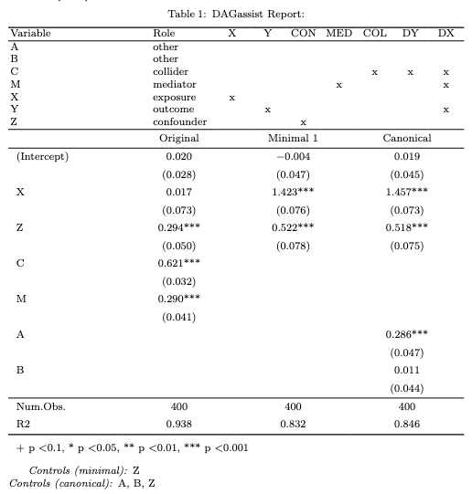

<!-- README.md is generated from README.Rmd. Please edit that file -->

# DAGassist

<!-- badges: start -->

[](https://github.com/grahamgoff/DAGassist/actions/workflows/R-CMD-check.yaml)
<!-- badges: end -->

**An all-in-one DAG-driven robustness check.** Classifies variables by
causal role, computes the smallest back-door adjustment set, and
compares the significance of the original and minimal models.

## Installation

You can install the development version of DAGassist from
[GitHub](https://github.com/) with:

``` r
install.packages("pak")
pak::pak("grahamgoff/DAGassist")

#load the library
library(DAGassist) 
```

## Quick start (console)

``` r
DAGassist(dag = test_complex, 
          formula = feols(Y ~ X + Z + B + A + C + M | region + time, data = test_df))
DAGassist Report: 

Roles:
variable  role        X  Y  conf  med  col  desc(Y)  desc(X)
X         exposure    x                                     
Y         outcome        x                           x      
Z         confounder        x                               
M         mediator                x                  x      
C         collider                     x    x        x      
A         other                                             
B         other                                             

 (!) Bad controls in your formula: {C, M}
Minimal controls 1: {Z}
Canonical controls: {A, B, Z}

Formulas:
  original:  Y ~ X + Z + B + A + C + M | region + time

Model comparison:

+------------+----------+-----------+-----------+
|            | Original | Minimal 1 | Canonical |
+============+==========+===========+===========+
| X          | -0.026   | 1.416***  | 1.449***  |
+------------+----------+-----------+-----------+
|            | (0.100)  | (0.066)   | (0.059)   |
+------------+----------+-----------+-----------+
| Z          | 0.304*** | 0.535***  | 0.532***  |
+------------+----------+-----------+-----------+
|            | (0.045)  | (0.071)   | (0.072)   |
+------------+----------+-----------+-----------+
| B          | 0.037    |           | 0.005     |
+------------+----------+-----------+-----------+
|            | (0.037)  |           | (0.053)   |
+------------+----------+-----------+-----------+
| A          | -0.045   |           | 0.278***  |
+------------+----------+-----------+-----------+
|            | (0.026)  |           | (0.031)   |
+------------+----------+-----------+-----------+
| C          | 0.627*** |           |           |
+------------+----------+-----------+-----------+
|            | (0.030)  |           |           |
+------------+----------+-----------+-----------+
| M          | 0.308*** |           |           |
+------------+----------+-----------+-----------+
|            | (0.050)  |           |           |
+------------+----------+-----------+-----------+
| Num.Obs.   | 400      | 400       | 400       |
+------------+----------+-----------+-----------+
| R2         | 0.941    | 0.838     | 0.851     |
+------------+----------+-----------+-----------+
| FE: region | X        | X         | X         |
+------------+----------+-----------+-----------+
| FE: time   | X        | X         | X         |
+============+==========+===========+===========+
| + p < 0.1, * p < 0.05, ** p < 0.01, *** p <   |
| 0.001                                         |
+============+==========+===========+===========+ 
```

## Export your results in LaTeX, Word, Excel, or plain text

``` r
DAGassist( 
  test_complex, Y ~ X + Z + C + M + A + B, test_df,
  type = "latex", out = "man/figures/README-latex.tex"
)
```



## Controlling DAG-based additions

By default `imply` = FALSE so no variables are added to your spec based
on the relationships in your DAG. Set `imply` = TRUE to get the complete
minimal and canonical adjustment sets, based on your DAG.

``` r
DAGassist(
  dag = test_complex,
  formula = lm(Y~X+C, data = test_df),
  imply = TRUE
)
DAGassist Report: 

Roles:
variable  role        X  Y  conf  med  col  desc(Y)  desc(X)
X         exposure    x                                     
Y         outcome        x                           x      
Z         confounder        x                               
M         mediator                x                  x      
C         collider                     x    x        x      
A         other                                             
B         other                                             

 (!) Bad controls in your formula: {C}
Minimal controls 1: {Z}
Canonical controls: {A, B, Z}

Formulas:
  original:  Y ~ X + C
  minimal 1 : Y ~ X + Z
  canonical: Y ~ X + A + B + Z

Note: DAGassist added variables not in your formula, based on the
relationships in your DAG, to block back-door paths
between X and Y.
  - Minimal 1 added: {Z}
  - Canonical added: {A, B, Z}

Model comparison:

+-------------+----------+-----------+-----------+
|             | Original | Minimal 1 | Canonical |
+=============+==========+===========+===========+
| (Intercept) | 0.012    | -0.004    | 0.019     |
+-------------+----------+-----------+-----------+
|             | (0.031)  | (0.047)   | (0.045)   |
+-------------+----------+-----------+-----------+
| X           | 0.146*   | 1.423***  | 1.457***  |
+-------------+----------+-----------+-----------+
|             | (0.074)  | (0.076)   | (0.073)   |
+-------------+----------+-----------+-----------+
| C           | 0.752*** |           |           |
+-------------+----------+-----------+-----------+
|             | (0.030)  |           |           |
+-------------+----------+-----------+-----------+
| Z           |          | 0.522***  | 0.518***  |
+-------------+----------+-----------+-----------+
|             |          | (0.078)   | (0.075)   |
+-------------+----------+-----------+-----------+
| A           |          |           | 0.286***  |
+-------------+----------+-----------+-----------+
|             |          |           | (0.047)   |
+-------------+----------+-----------+-----------+
| B           |          |           | 0.011     |
+-------------+----------+-----------+-----------+
|             |          |           | (0.044)   |
+-------------+----------+-----------+-----------+
| Num.Obs.    | 400      | 400       | 400       |
+-------------+----------+-----------+-----------+
| R2          | 0.926    | 0.832     | 0.846     |
+=============+==========+===========+===========+
| + p < 0.1, * p < 0.05, ** p < 0.01, *** p <    |
| 0.001                                          |
+=============+==========+===========+===========+ 
```
