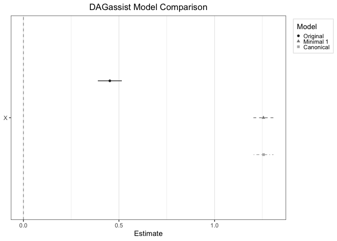

<!-- README.md is generated from README.Rmd. Please edit that file -->

# DAGassist <a href='https://grahamgoff.github.io/DAGassist/'></a>

<!-- badges: start -->

[](https://github.com/grahamgoff/DAGassist/actions/workflows/R-CMD-check.yaml)
[](https://github.com/grahamgoff/DAGassist/actions/workflows/pages/pages-build-deployment)
[](https://cran.r-project.org/package=DAGassist)
[](https://lifecycle.r-lib.org/articles/stages.html)
<!-- badges: end -->

## **An all-in-one DAG-driven robustness check.** Generate publication-quality reports that classify variables by causal role, compare the significance of DAG-derived models, and explicitly target estimands.

## What `DAGassist` does:

- Classifies covariates by causal role (confounder, mediator, collider,
  descendants, neutral controls, etc.).
- Automates the reestimation of models using DAG-derived adjustment
  sets.
- Targets explicit estimands to facilitate transparent comparison
  between models.
- Produces publication-grade reports in multiple formats
  (LaTeX/Word/Excel/markdown/plain text + dotwhisker).
- Provides weight diagnostics to evaluate positivity and effective
  sample sizes.

See the [Quick
Tour](https://grahamgoff.github.io/DAGassist/articles/quick-tour.html)
vignette for a 10 minute start-to-finish guide on how to use `DAGassist`
to identify causal roles, create reports, and interpret the results.

See the [Making
Reports](https://grahamgoff.github.io/DAGassist/articles/making-reports.html)
vignette for details on producing publication-quality `DAGassist`
reports in `LaTex`, `Word`, `Excel`, and `plain text`. See the
[Parameter
Guide](https://grahamgoff.github.io/DAGassist/articles/get-started.html)
vignette for examples of how to get the most out of `DAGassist`.

See the [Supported
Models](https://grahamgoff.github.io/DAGassist/articles/compatibility.html)
vignette for documentation on what engines `DAGassist` supports.

See the [Ecosystem
Guide](https://grahamgoff.github.io/DAGassist/articles/ecosystem.html)
for how `DAGassist` fits in the R DAG ecosystem—and a diagram of the
packages it integrates with.

## Installation

You can install `DAGassist` with:

``` r
install.packages("DAGassist")
library(DAGassist) 
```

Or you can install the development version from GitHub with:

``` r
# install.packages("devtools")
devtools::install_github("grahamgoff/DAGassist")
```

## Example

Simply provide a `dagitty()` object and a regression call and
`DAGassist` will create a report classifying variables by causal role,
and compare the specified regression to minimal and canonical models.

``` r
DAGassist::DAGassist(dag = dag_model, 
          formula = feols(Y ~ X + M + C + Z + A + B, data = df))
#> DAGassist Report: 
#> 
#> Roles:
#> variable  role        Exp.  Out.  conf  med  col  dOut  dMed  dCol  dConfOn  dConfOff  NCT  NCO
#> X         exposure    x                                                                        
#> Y         outcome           x                                                                  
#> Z         confounder              x                                                            
#> M         mediator                      x                                                      
#> C         collider                           x    x     x                                      
#> A         nco                                                                               x  
#> B         nco                                                                               x  
#> 
#>  (!) Bad controls in your formula: {M, C}
#> Minimal controls 1: {Z}
#> Canonical controls: {A, B, Z}
#> 
#> Formulas:
#>   original:  Y ~ X + M + C + Z + A + B
#> 
#> Model comparison:
#> 
#> +----------+-----------+-----------+-----------+
#> |          | Original  | Minimal 1 | Canonical |
#> +==========+===========+===========+===========+
#> | X        | 0.452***  | 1.256***  | 1.256***  |
#> +----------+-----------+-----------+-----------+
#> |          | (0.032)   | (0.027)   | (0.026)   |
#> +----------+-----------+-----------+-----------+
#> | M        | 0.514***  |           |           |
#> +----------+-----------+-----------+-----------+
#> |          | (0.021)   |           |           |
#> +----------+-----------+-----------+-----------+
#> | C        | 0.343***  |           |           |
#> +----------+-----------+-----------+-----------+
#> |          | (0.019)   |           |           |
#> +----------+-----------+-----------+-----------+
#> | Z        | 0.249***  | 0.311***  | 0.309***  |
#> +----------+-----------+-----------+-----------+
#> |          | (0.027)   | (0.034)   | (0.033)   |
#> +----------+-----------+-----------+-----------+
#> | A        | 0.152***  |           | 0.187***  |
#> +----------+-----------+-----------+-----------+
#> |          | (0.021)   |           | (0.026)   |
#> +----------+-----------+-----------+-----------+
#> | B        | -0.069*** |           | -0.057*   |
#> +----------+-----------+-----------+-----------+
#> |          | (0.021)   |           | (0.026)   |
#> +----------+-----------+-----------+-----------+
#> | Num.Obs. | 2000      | 2000      | 2000      |
#> +----------+-----------+-----------+-----------+
#> | R2       | 0.818     | 0.706     | 0.714     |
#> +==========+===========+===========+===========+
#> | + p < 0.1, * p < 0.05, ** p < 0.01, *** p <  |
#> | 0.001                                        |
#> +==========+===========+===========+===========+ 
#> 
#> Roles legend: Exp. = exposure; Out. = outcome; CON = confounder; MED = mediator; COL = collider; dOut = descendant of outcome; dMed  = descendant of mediator; dCol = descendant of collider; dConfOn = descendant of a confounder on a back-door path; dConfOff = descendant of a confounder off a back-door path; NCT = neutral control on treatment; NCO = neutral control on outcome

# note: this example uses a test DAG and dataset, which was created
# silently for the sake of brevity.
```

Optionally, users can generate visual output via dotwhisker plots:

``` r
DAGassist::DAGassist(dag = dag_model,
          formula = feols(Y ~ X + M + C + Z + A + B, data = df),
          type = "dotwhisker")
```


