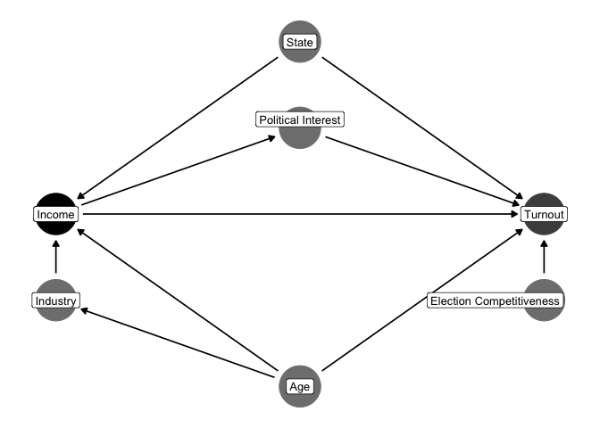
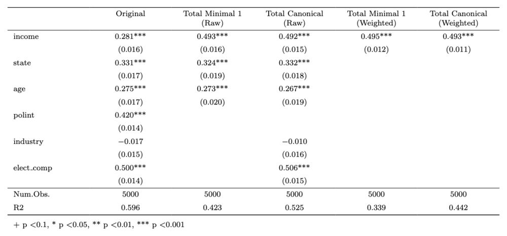
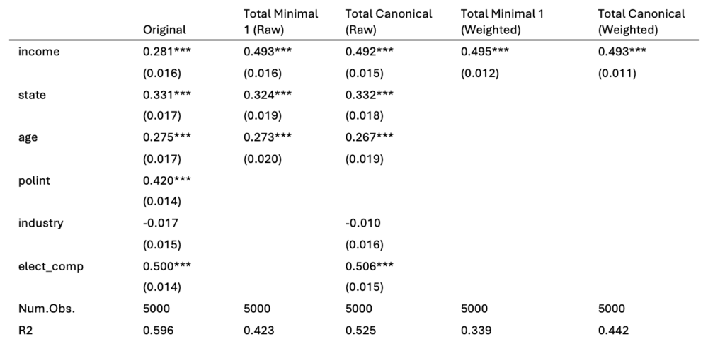
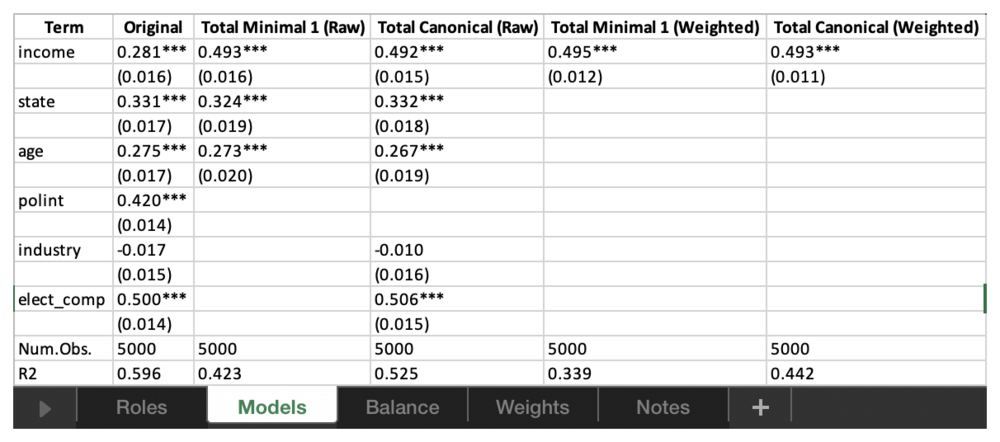
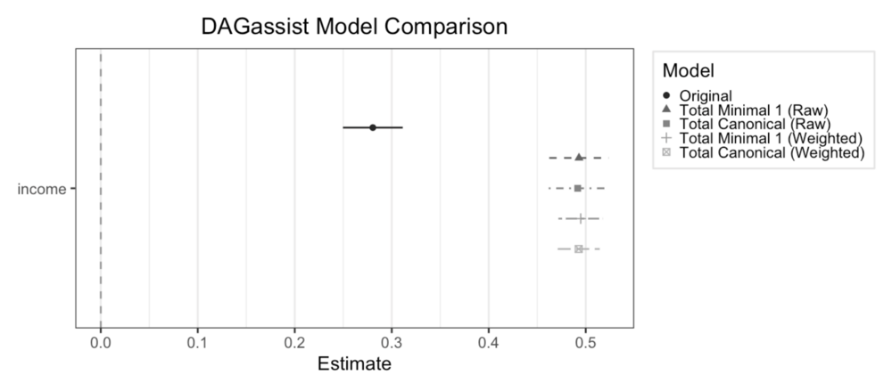

<!-- README.md is generated from README.Rmd. Please edit that file -->

# DAGassist: Align Regressions with Target Estimands <a href='https://grahamgoff.com/DAGassist/'></a>

[](https://github.com/grahamgoff/DAGassist/actions/workflows/R-CMD-check.yaml)
[](https://github.com/grahamgoff/DAGassist/actions/workflows/pages/pages-build-deployment)
[](https://cran.r-project.org/package=DAGassist)
[](https://lifecycle.r-lib.org/articles/stages.html)
[](https://cran.r-project.org/package=DAGassist)

This R package enables researchers to align their regressions with their
target estimands. The package provides tools for classifying DAG nodes
by their causal roles, automating DAG-consistent re-estimation, and
producing publication-grade diagnostic reports in
LaTeX/Word/Excel/.md/.txt/dotwhisker. Uncertainty analysis functions
allow researchers to check whether their conclusions survive uncertain
edge directions or plausibly missing arrows.

------------------------------------------------------------------------

## Installation

You can install `DAGassist` with:

``` r
install.packages("DAGassist")
library(DAGassist) 
```

You can also install the development version of `DAGassist` using
`devtools`:

``` r
# install.packages("devtools")
devtools::install_github("grahamgoff/DAGassist")
```

## Getting Started

### Setup

Before using `DAGassist`, collect your data and create a DAG of your
hypothesized data generating process (DGP) using `dagitty` or `ggdag`.
To begin, we use a canonical political science example–the effect of
individual income on voter turnout.



In our hypothesized DGP, an individual’s age and state of residence
jointly influece their income and propensity to vote. Political interest
mediates the relationship between income and turnout; it is one of the
mechanisms through which the independent variable effects the outcome.
Individuals industries of employment and election competitiveness are
neutral controls on the treatment and outcome, respectively. We simulate
our DGP below.

### Using `DAGassist`

To use `DAGassist`, simply provide a `dagitty()` object and a regression
call. First, let’s use `DAGassist` to create a report classifying
variables by causal role. This step only requires a DAG object–no data.

``` r
DAGassist(dag = turnout_dag, 
          show = "roles",
          type = "text",
          verbose = FALSE
)
```

| Variable | Role | Exp. | Out. | `CON` | `MED` | `COL` | `dOut` | `dMed` | `dCol` | dConfOn | dConfOff | `NCT` | `NCO` |
|:---|:--:|:--:|:--:|:--:|:--:|:--:|:--:|:--:|:--:|:--:|:--:|:--:|:--:|
| age | confounder |  |  | x |  |  |  |  |  |  |  |  |  |
| elect_comp | nco |  |  |  |  |  |  |  |  |  |  |  | x |
| income | exposure | x |  |  |  |  |  |  |  |  |  |  |  |
| industry | nct |  |  |  |  |  |  |  |  | x |  | x |  |
| polint | mediator |  |  |  | x |  |  |  |  |  |  |  |  |
| state | confounder |  |  | x |  |  |  |  |  |  |  |  |  |
| turnout | outcome |  | x |  |  |  |  |  |  |  |  |  |  |

- p-value legend: + \< 0.1, \* \< 0.05, \*\* \< 0.01, \*\*\* \< 0.001.

[This](https://grahamgoff.com/DAGassist/articles/DAGassist.html)
vignette defines the different variable types (e.g., mediator, neutral
controls, etc.) in greater detail.

The above report shows that a mediator, polint, has entered our
regression and shifted our estimand. Let us rerun the models with
`DAGassist`.

``` r
#load simulated data
data("turnout_data")

DAGassist(dag = turnout_dag, 
          formula = lm(turnout ~ income + state + age + polint + industry + elect_comp, data = turnout_data),
          estimand = c("total", "direct"),
          show = "models",
          type = "text", 
          verbose = FALSE
)
```

| Term | Original | Total Minimal 1 (Raw) | Total Canonical (Raw) | Total Minimal 1 (Weighted) | Total Canonical (Weighted) | Direct (Raw) | Direct (Weighted) |
|:---|:--:|:--:|:--:|:--:|:--:|:--:|:--:|
| income | 0.281\*\*\* | 0.493\*\*\* | 0.492\*\*\* | 0.495\*\*\* | 0.493\*\*\* | 0.281\*\*\* | 0.280\*\*\* |
|   | (0.016) | (0.016) | (0.015) | (0.012) | (0.011) | (0.014) | (0.027) |
| state | 0.331\*\*\* | 0.324\*\*\* | 0.332\*\*\* |  |  | 0.331\*\*\* | 0.343\*\*\* |
|   | (0.017) | (0.019) | (0.018) |  |  | (0.017) | (0.031) |
| age | 0.275\*\*\* | 0.273\*\*\* | 0.267\*\*\* |  |  | 0.275\*\*\* | 0.272\*\*\* |
|   | (0.017) | (0.020) | (0.019) |  |  | (0.017) | (0.028) |
| polint | 0.420\*\*\* |  |  |  |  |  |  |
|   | (0.014) |  |  |  |  |  |  |
| industry | -0.017 |  | -0.010 |  |  | -0.017 | -0.014 |
|   | (0.015) |  | (0.016) |  |  | (0.015) | (0.024) |
| elect_comp | 0.500\*\*\* |  | 0.506\*\*\* |  |  | 0.500\*\*\* | 0.476\*\*\* |
|   | (0.014) |  | (0.015) |  |  | (0.014) | (0.025) |
| Num.Obs. | 5000 | 5000 | 5000 | 5000 | 5000 | 5000 | 5000 |
| R2 | 0.596 | 0.423 | 0.525 | 0.339 | 0.442 |  |  |

- p-value legend: + \< 0.1, \* \< 0.05, \*\* \< 0.01, \*\*\* \< 0.001.
- Controls (minimal): {age, state}.
- Controls (canonical): {age, elect_comp, industry, state}.

By construction the total effect is 0.50 and the direct effect is 0.30.
The original specification, which controls for a mediator, returns
0.281. Without `DAGassist`, the researcher might present their model as
estimating the total effect of income on voter turnout. `DAGassist`
detects the estimand-shifting variable, and automatically reestimates
with transparent estimands.

Users may want to share their results, either in response to reviewers
or as a general appendix robustness check. `DAGassist` supports easily
exporting diagnostics across popular file formats by setting the
`type =` and `out =` parameters. Below, we generate reports across all
of the file formats using a loop. We also include code for simple
single-format output that coes not rely on a loop.

``` r
formats <- c(latex = "latex.tex",  word  = "word.docx",
             excel = "excel.xlsx", dotwhisker = "dw.png")

for (fmt in names(formats)) {
  DAGassist(dag      = turnout_dag,
            formula  = lm(turnout ~ income + state + age + polint + industry + elect_comp, data = turnout_data),
            estimand = "total",
            type     = fmt,
            out      = formats[[fmt]])
}

#for single-format output
# DAGassist(dag = dag_model,
#           formula  = lm(turnout ~ income + state + age + polint + industry + elect_comp, data = df),
#           estimand = "total",
#           type = "latex",
#           out = "out/path/file_name.tex")
```

<table class="gallery">

<tr>

<td>

<a href="man/figures/README-latex.png"></a><br><em>LaTeX
(<code>tabularray</code>)</em>
</td>

<td>

<a href="man/figures/README-word.png"></a><br><em>Word</em>
</td>

</tr>

<tr>

<td>

<a href="man/figures/README-excel.png"></a><br><em>Excel</em>
</td>

<td>

<br><em>dotwhisker</em>
</td>

</tr>

</table>

## Learn more

- [Get
  started](https://grahamgoff.com/DAGassist/articles/DAGassist.html) —
  the full workflow
- [Supported model
  engines](https://grahamgoff.com/DAGassist/articles/compatibility.html)
  — `DAGassist` supports most DV ~ IV-format estimators.
- [Reference](https://grahamgoff.com/DAGassist/reference/) — all
  functions

## Citation

``` r
citation("DAGassist")
#> To cite package 'DAGassist' in publications use:
#> 
#>   Goff G, Denly M (2026). _DAGassist: Test Robustness with Directed
#>   Acyclic Graphs_. R package version 0.3.1,
#>   <https://grahamgoff.com/DAGassist/>.
#> 
#> A BibTeX entry for LaTeX users is
#> 
#>   @Manual{,
#>     title = {{DAGassist}: Test Robustness with Directed Acyclic Graphs},
#>     author = {Graham Goff and Michael Denly},
#>     year = {2026},
#>     note = {R package version 0.3.1},
#>     url = {https://grahamgoff.com/DAGassist/},
#>   }
```
