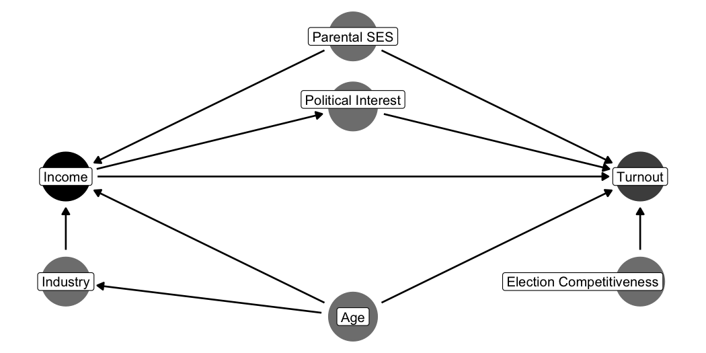
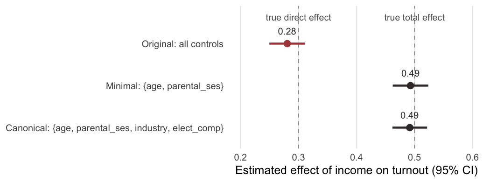
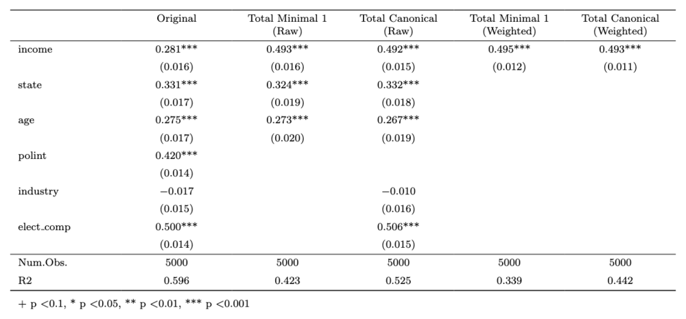
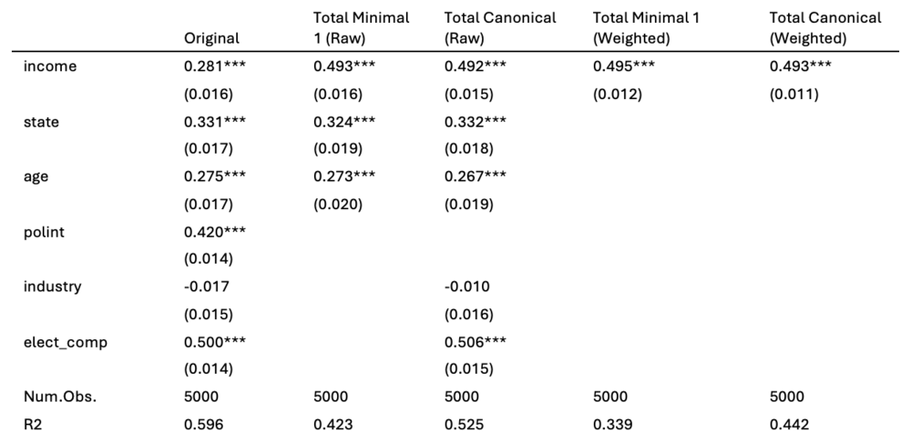
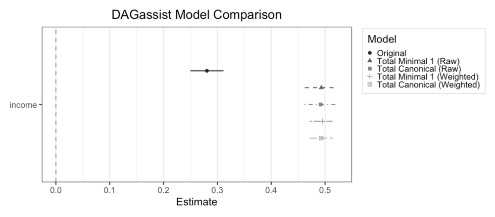

<!-- README.md is generated from README.Rmd. Please edit that file -->

# DAGassist: Align Regressions with Target Estimands <a href='https://grahamgoff.com/DAGassist/'></a>

<!-- badges: start -->

[](https://github.com/grahamgoff/DAGassist/actions/workflows/R-CMD-check.yaml)
[](https://cran.r-project.org/package=DAGassist)
[](https://lifecycle.r-lib.org/articles/stages.html)
[](https://cran.r-project.org/package=DAGassist)
<!-- badges: end -->

Adding a control variable can change what a regression estimates, not
just how precisely it estimates it. Conditioning on mediators,
colliders, or their descendants can shift the target estimand or
introduce bias. However, researchers cannot infer these consequences
from conventional regression output alone.

**DAGassist** reads your causal diagram (DAG) and your regression, flags
the controls that shift the estimand, and re-fits the model with
DAG-derived adjustment sets, so the number you report answers the
question you asked.

------------------------------------------------------------------------

## Installation

You can install `DAGassist` with:

``` r
install.packages("DAGassist")
```

You can also install the development version using `devtools`:

``` r
# install.packages("devtools")
devtools::install_github("grahamgoff/DAGassist")
```

## Example

Does higher income increase voter turnout? `turnout_data` is simulated
from the DAG below, so the right answers are known: income’s **total
effect is 0.50**, of which **0.30 is direct** and 0.20 runs through
political interest.



A common approach is to control for everything available. Pass the DAG
and that regression to `DAGassist()`:

``` r
DAGassist(turnout_dag,
          lm(turnout ~ income + state + age + polint + industry + elect_comp,
             data = turnout_data),
          show = "roles", type = "text", verbose = FALSE)
```

| Variable   |    Role    | Exp. | Out. | `CON` | `MED` | dConfOn | `NCT` | `NCO` |
|:-----------|:----------:|:----:|:----:|:-----:|:-----:|:-------:|:-----:|:-----:|
| age        | confounder |      |      |   x   |       |         |       |       |
| elect_comp |    nco     |      |      |       |       |         |       |   x   |
| income     |  exposure  |  x   |      |       |       |         |       |       |
| industry   |    nct     |      |      |       |       |    x    |   x   |       |
| polint     |  mediator  |      |      |       |   x   |         |       |       |
| state      | confounder |      |      |   x   |       |         |       |       |
| turnout    |  outcome   |      |  x   |       |       |         |       |       |

`polint` is a mediator; it is one of the mechanisms through which income
affects turnout. Thus, controlling for it makes the regression return
the direct effect of income on turnout rather than the total effect. The
[Get started](https://grahamgoff.com/DAGassist/articles/DAGassist.html)
article defines each causal role in detail. Without `show = "roles"`,
`DAGassist()` also re-fits the model with the adjustment sets the DAG
implies:

``` r
DAGassist(turnout_dag,
          lm(turnout ~ income + state + age + polint + industry + elect_comp,
             data = turnout_data),
          show = "models", type = "text", verbose = FALSE)
```

| Term       |  Original   |  Minimal 1  |  Canonical  |
|:-----------|:-----------:|:-----------:|:-----------:|
| income     | 0.281\*\*\* | 0.493\*\*\* | 0.492\*\*\* |
|            |   (0.016)   |   (0.016)   |   (0.015)   |
| state      | 0.331\*\*\* | 0.324\*\*\* | 0.332\*\*\* |
|            |   (0.017)   |   (0.019)   |   (0.018)   |
| age        | 0.275\*\*\* | 0.273\*\*\* | 0.267\*\*\* |
|            |   (0.017)   |   (0.020)   |   (0.019)   |
| polint     | 0.420\*\*\* |             |             |
|            |   (0.014)   |             |             |
| industry   |   -0.017    |             |   -0.010    |
|            |   (0.015)   |             |   (0.016)   |
| elect_comp | 0.500\*\*\* |             | 0.506\*\*\* |
|            |   (0.014)   |             |   (0.015)   |
| Num.Obs.   |    5000     |    5000     |    5000     |
| R2         |    0.596    |    0.423    |    0.525    |

- p-value legend: + \< 0.1, \* \< 0.05, \*\* \< 0.01, \*\*\* \< 0.001.
- Controls (minimal): {age, state}.
- Controls (canonical): {age, elect_comp, industry, state}.

The original regression’s 0.28 is close to the *direct* effect (0.30).
Both DAG-derived models recover the total effect. Without `DAGassist`,
the researcher might present their model as estimating the total effect
of income on voter turnout. `DAGassist` detects the estimand-shifting
variable, and automatically reestimates with transparent estimands.



## What else DAGassist does

- **Target an estimand explicitly.** `estimand = "total"` or `"direct"`
  re-estimates with weighting or sequential g-estimation.
- **Stress-test the DAG.** `pdag_robustness()` checks arrows whose
  direction you’re unsure of; `add_edges_robustness()` checks arrows you
  may have left out.
- **Check that models are comparable.** Balance diagnostics flag when
  listwise deletion changes who is in each model’s sample.
- **Work with your estimator.** `lm`, `glm`, `fixest`, `lme4`,
  `estimatr`, and most other `y ~ x` engines ([supported
  engines](https://grahamgoff.com/DAGassist/articles/compatibility.html)).
- **Export for papers and reviewers.** Set `type =` to write LaTeX,
  Word, Excel, plain-text, or dot-and-whisker output:

<table class="gallery">

<tr>

<td>

<a href="man/figures/README-latex.png"></a><br><em>LaTeX
(<code>tabularray</code>)</em>
</td>

<td>

<a href="man/figures/README-word.png"></a><br><em>Word</em>
</td>

</tr>

<tr>

<td>

<a href="man/figures/README-excel.png"></a><br><em>Excel</em>
</td>

<td>

<br><em>dotwhisker</em>
</td>

</tr>

</table>

## Citation

``` r
citation("DAGassist")
#> To cite package 'DAGassist' in publications use:
#> 
#>   Goff G, Denly M (2026). _DAGassist: Align Regressions with Target
#>   Estimands_. R package version 0.3.1,
#>   <https://grahamgoff.com/DAGassist/>.
#> 
#> A BibTeX entry for LaTeX users is
#> 
#>   @Manual{,
#>     title = {{DAGassist}: Align Regressions with Target Estimands},
#>     author = {Graham Goff and Michael Denly},
#>     year = {2026},
#>     note = {R package version 0.3.1},
#>     url = {https://grahamgoff.com/DAGassist/},
#>   }
```
