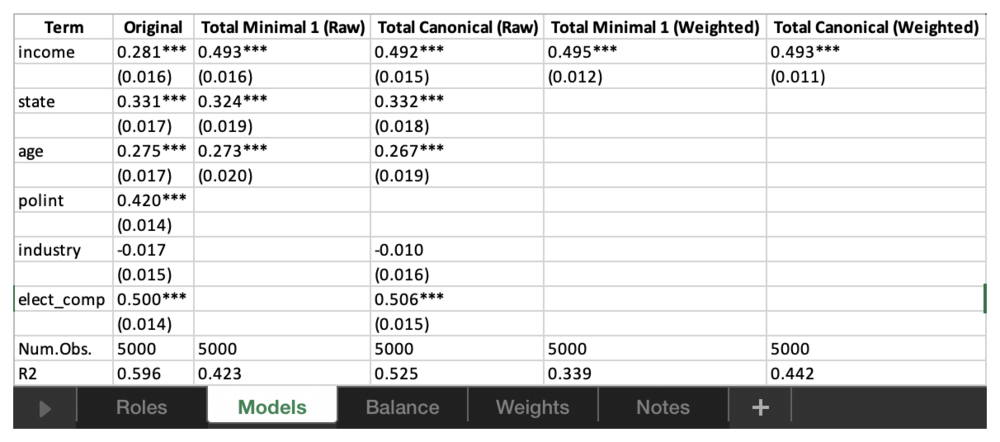

# Exporting reports

`DAGassist` reports are meant to leave your R console: as an appendix
table in a paper, a response to a reviewer, or a file for a co-author.
Users can easily export reports through two arguments. `type` sets the
format, and `out` sets the file path and name. This article explains how
to export your `DAGassist` report. The examples use the voter-turnout
data from the [homepage](https://grahamgoff.com/DAGassist/index.md).

``` r

library(DAGassist)
```

## Formats at a glance

| `type` | Produces | `out` | Also needs |
|:---|:---|:---|:---|
| `"console"` (default) | The report, printed in the console | Not used |  |
| `"latex"` | A LaTeX fragment to `\input{}` into a paper | Optional; prints the fragment if omitted | `modelsummary` |
| `"word"` or `"docx"` | A Word document | Required | `modelsummary`, `knitr`, `rmarkdown`, and pandoc 2.0+ |
| `"excel"` or `"xlsx"` | An Excel workbook, one sheet per section | Required | `modelsummary` |
| `"text"` or `"txt"` | A plain-text file with Markdown tables | Optional; prints if omitted | `modelsummary`, `knitr` |
| `"dotwhisker"` or `"dwplot"` | A dot-and-whisker plot (PNG) | Optional; displays the plot if omitted |  |

The packages in the last column are suggested dependencies for each
export format, so install them prior to exporting. RStudio ships with
pandoc, so Word export works there without extra setup.

## Generating individual and multiple reports

To produce every format at once, create a loop where each export is the
same
[`DAGassist()`](https://grahamgoff.com/DAGassist/reference/DAGassist.md)
call with a different `type` and `out`:

``` r

out_dir <- tempdir()
formats <- c(latex      = "report.tex",
             word       = "report.docx",
             excel      = "report.xlsx",
             text       = "report.txt",
             dotwhisker = "report.png")

for (fmt in names(formats)) {
  DAGassist(turnout_dag,
            lm(turnout ~ income + state + age + polint + industry + elect_comp,
               data = turnout_data),
            type = fmt,
            out  = file.path(out_dir, formats[[fmt]]))
}

file.exists(file.path(out_dir, formats))
#> [1] TRUE TRUE TRUE TRUE TRUE
```

To write a single file, drop the loop:

``` r

DAGassist(turnout_dag,
          lm(turnout ~ income + state + age + polint + industry + elect_comp,
             data = turnout_data),
          type = "latex",
          out  = "tables/dagassist.tex")
```

## Choosing what goes in the report

The same arguments that specify the console output contents affect
exported reports:

- **`show`** selects sections. `show = "models"` exports only the model
  comparison, whereas `show = "roles"` exports only the roles table.
- **`labels`** replaces variable names with readable labels. It takes a
  named character vector, or a data frame.
- **`estimand`** adds the total- and direct-effect columns described in
  [Total and direct
  effects](https://grahamgoff.com/DAGassist/articles/estimands.md).
  Weight and balance diagnostics are exported alongside them.
- **`exclude`** adds canonical-set variants without neutral controls, as
  extra `Canon. (-NCO)` or `Canon. (-NCT)` columns.
- **`omit_intercept`** and **`omit_factors`** (both `TRUE` by default)
  hide the intercept and factor-level rows from the table. The terms
  still enter the regression.

For a publication table, set `labels` and `show = "models"`:

``` r

turnout_labels <- c(
  income     = "Income",
  state      = "State",
  age        = "Age",
  polint     = "Political interest",
  industry   = "Industry",
  elect_comp = "Election competitiveness"
)

DAGassist(turnout_dag,
          lm(turnout ~ income + state + age + polint + industry + elect_comp,
             data = turnout_data),
          labels = turnout_labels,
          show = "models", type = "text", verbose = FALSE)
```

| Term                     |  Original   |  Minimal 1  |  Canonical  |
|:-------------------------|:-----------:|:-----------:|:-----------:|
| Income                   | 0.281\*\*\* | 0.493\*\*\* | 0.492\*\*\* |
|                          |   (0.016)   |   (0.016)   |   (0.015)   |
| State                    | 0.331\*\*\* | 0.324\*\*\* | 0.332\*\*\* |
|                          |   (0.017)   |   (0.019)   |   (0.018)   |
| Age                      | 0.275\*\*\* | 0.273\*\*\* | 0.267\*\*\* |
|                          |   (0.017)   |   (0.020)   |   (0.019)   |
| Political interest       | 0.420\*\*\* |             |             |
|                          |   (0.014)   |             |             |
| Industry                 |   -0.017    |             |   -0.010    |
|                          |   (0.015)   |             |   (0.016)   |
| Election competitiveness | 0.500\*\*\* |             | 0.506\*\*\* |
|                          |   (0.014)   |             |   (0.015)   |
| Num.Obs.                 |    5000     |    5000     |    5000     |
| R2                       |    0.596    |    0.423    |    0.525    |

- p-value legend: + \< 0.1, \* \< 0.05, \*\* \< 0.01, \*\*\* \< 0.001.
- Controls (minimal): {age, state}.
- Controls (canonical): {age, elect_comp, industry, state}.

## LaTeX

`type = "latex"` writes a fragment, not a full document, so you
`\input{}` it where the table should appear. The tables use
[tabularray](https://ctan.org/pkg/tabularray)’s `longtblr`, so long
tables break across pages. Add these lines to your preamble:

``` latex
\usepackage{graphicx}   % rotated column headers in the roles table
\usepackage{tabularray}
\UseTblrLibrary{booktabs,siunitx}
```

The full report is labelled `tab:dagassist`, and a models-only table
(`show = "models"`) is labelled `tab:dagassist-models`, so you can refer
to either with `\ref{}`.

Without `out`, the fragment is printed to the console, ready to paste
into Overleaf:

``` r

DAGassist(turnout_dag,
          lm(turnout ~ income + state + age + polint + industry + elect_comp,
             data = turnout_data),
          labels = turnout_labels,
          show = "models", type = "latex")
```


The model comparison table, typeset in LaTeX.

## Word

`type = "word"` builds the report as Markdown and converts it to `.docx`
with pandoc. To match a journal’s or your department’s styles, point
`DAGassist` at a reference document once per session; pandoc copies its
fonts, heading styles, and table styles:

``` r

options(DAGassist.ref_docx = "my-template.docx")
```


The report in a Word document.

## Excel

`type = "excel"` writes one sheet per section of the report, which makes
the results easy to share with co-authors or reformat by hand:

``` r

readxl::excel_sheets(file.path(out_dir, "report.xlsx"))
#> [1] "Roles"   "Models"  "Balance" "Notes"
```

A `Weights` sheet is added when the report includes weighted estimates
(`estimand = "total"` or `"direct"`).



The Excel workbook.

## Plain text and Markdown

`type = "text"` writes the report with Markdown tables. The file reads
cleanly as plain text and renders as formatted tables on GitHub or in a
reviewer response. Without `out`, it prints to the console; in an R
Markdown or Quarto document, set the chunk option `results = "asis"` to
render the tables, as this site does.

## Dot-and-whisker plots

`type = "dotwhisker"` plots the exposure’s estimate and 95% confidence
interval in each model. Without `out`, the plot is displayed; with
`out`, it is saved as an 8 × 6 inch PNG at 300 dpi.

``` r

DAGassist(turnout_dag,
          lm(turnout ~ income + state + age + polint + industry + elect_comp,
             data = turnout_data),
          type = "dotwhisker")
```


