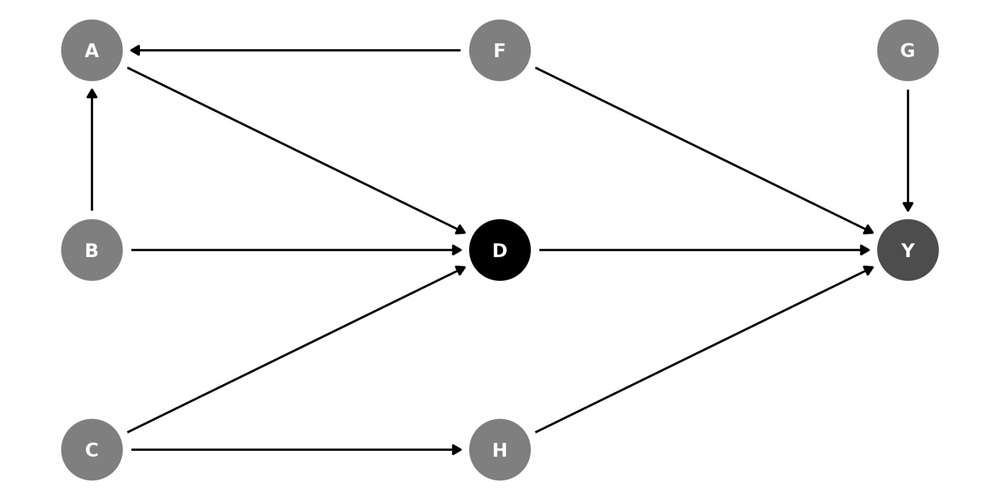

# Getting Started with Report Creation

## Introduction

This vignette explains how to make publication-grade DAGassist reports
in LaTeX, Word, Excel, and plaintext. Since this package’s primary
utility is as a robustness check for observational studies, most of its
functionality revolves around creating reports.

### Install and load `DAGassist`

``` r
# install development release from github
install.packages("pak")
pak::pak("grahamgoff/DAGassist")

# or, install stable release from CRAN
install.packages("DAGassist")

#load DAGassist
library(DAGassist) 
```

### Setup

In addition to loading `DAGassist`, we will load the following baseline
packages:

- `modelsummary` to build the **model comparison** table for **LaTeX**,
  **Word**, **Excel**, and **plaintext**.
  - LaTeX uses `broom` as a fallback for report generation
- `knitr` to build intermediate .md for **Word** and **plaintext**
  report generation.
- `rmarkdown` to convert .md files to .docx files for **Word** report
  generation.
- `writexl` to export **Excel** files.

Essentially, to export:

- **LaTeX** only needs `modelsummary`
- **Excel** needs `modelsummary` and `writexl`
- **plaintext** needs `modelsummary` and `knitr`
- **Word** needs `modelsummary`, `knitr`, and `rmarkdown`

``` r
#load libraries to help export
library(modelsummary)
library(writexl)
library(knitr)
library(rmarkdown)
```

### Example DAG



The data, which simulates the DAG relationships:

``` r
head(df)
#>            Y          D          H          A           G          F
#> 1 -4.3598990 -1.7293707 -1.2908129 -0.3906503 -0.15030748 -0.5116037
#> 2  1.6129050  1.0748492  0.2956294  0.6771872 -0.32775713  0.2369379
#> 3  1.5096451  1.0922811 -1.1613337  1.1254048 -1.44816529 -0.5415892
#> 4  1.1554071 -0.5867292  1.3752785 -0.5173670 -0.69728458  1.2192276
#> 5  0.2920729 -2.0225129 -1.1232830 -1.8569842  2.59849023  0.1741359
#> 6  3.1428430  3.0900447  1.1675898  2.6936976 -0.03741501 -0.6152683
#>             C           B
#> 1 -0.99579872 -0.56047565
#> 2 -1.03995504 -0.23017749
#> 3 -0.01798024  1.55870831
#> 4 -0.13217513  0.07050839
#> 5 -2.54934277  0.12928774
#> 6  1.04057346  1.71506499
```

### Creating a report

Suppose you wrote an article uses model `original` as its main finding,
and you want to ensure that your specification captures the total effect
of `D` on `Y`, without mediator or collider bias.

``` r
original <- lm(Y ~ D + G + H + F + A + B + C, data = df)
```

DAGassist can generate a report assessing the causal roles of the
variables in `original`.

``` r
DAGassist(dag = dag_model, #specify a dagitty or ggdag object
          formula = lm(Y ~ D + G + H + F + A + B + C, data = df), #provide your formula
          type = "text", #output type
          out = out_txt) #a temporary directory, for the purpose of this vignette

cat(readLines(out_txt), sep = "\n") # show the output
```

### DAGassist Report:

### Roles

| Variable |    Role    | Exp. | Out. | `CON` | `MED` | `COL` | `dOut` | `dMed` | `dCol` | dConfOn | dConfOff | `NCT` | `NCO` |
|:---------|:----------:|:----:|:----:|:-----:|:-----:|:-----:|:------:|:------:|:------:|:-------:|:--------:|:-----:|:-----:|
| A        |    nct     |      |      |       |       |       |        |        |        |    x    |          |   x   |       |
| B        |    nct     |      |      |       |       |       |        |        |        |         |          |   x   |       |
| C        |    nct     |      |      |       |       |       |        |        |        |         |          |   x   |       |
| D        |  exposure  |  x   |      |       |       |       |        |        |        |         |          |       |       |
| F        | confounder |      |      |   x   |       |       |        |        |        |         |          |       |       |
| G        |    nco     |      |      |       |       |       |        |        |        |         |          |       |   x   |
| H        |    nco     |      |      |       |       |       |        |        |        |         |          |       |   x   |
| Y        |  outcome   |      |  x   |       |       |       |        |        |        |         |          |       |       |

#### Models

| Term     |  Original   |  Minimal 1  |  Minimal 2  |  Minimal 3   |  Minimal 4   |  Canonical  |
|:---------|:-----------:|:-----------:|:-----------:|:------------:|:------------:|:-----------:|
| D        | 1.034\*\*\* | 0.977\*\*\* | 0.969\*\*\* | 1.038\*\*\*  | 1.024\*\*\*  | 1.034\*\*\* |
|          |   (0.032)   |   (0.020)   |   (0.023)   |   (0.036)    |   (0.041)    |   (0.032)   |
| G        | 0.397\*\*\* |             |             |              |              | 0.397\*\*\* |
|          |   (0.032)   |             |             |              |              |   (0.032)   |
| H        | 0.486\*\*\* | 0.522\*\*\* |             | 0.495\*\*\*  |              | 0.486\*\*\* |
|          |   (0.032)   |   (0.028)   |             |   (0.031)    |              |   (0.032)   |
| F        | 0.618\*\*\* | 0.606\*\*\* | 0.593\*\*\* |              |              | 0.618\*\*\* |
|          |   (0.037)   |   (0.036)   |   (0.040)   |              |              |   (0.037)   |
| A        | -0.111\*\*  |             |             | 0.158\*\*\*  | 0.169\*\*\*  | -0.111\*\*  |
|          |   (0.043)   |             |             |   (0.047)    |   (0.051)    |   (0.043)   |
| B        |   -0.008    |             |             | -0.161\*\*\* | -0.162\*\*\* |   -0.008    |
|          |   (0.039)   |             |             |   (0.045)    |   (0.049)    |   (0.039)   |
| C        |    0.037    |             | 0.420\*\*\* |              | 0.391\*\*\*  |    0.037    |
|          |   (0.042)   |             |   (0.040)   |              |   (0.045)    |   (0.042)   |
| Num.Obs. |    1000     |    1000     |    1000     |     1000     |     1000     |    1000     |
| R2       |    0.836    |    0.809    |    0.769    |    0.762     |    0.724     |    0.836    |

##### Notes

- Roles legend: X (exposure); Y (outcome); CON (confounder); MED
  (mediator); COL (collider); dOut (proper descendant of Y); dMed
  (proper descendant of any mediator); dCol (proper descendant of any
  collider); dConfOn (descendant of a confounder on a back-door path);
  dConfOff (descendant of a confounder off a back-door path); NCT
  (neutral control on treatment); NCO (neutral control on outcome).
- p-value legend: + \< 0.1, \* \< 0.05, \*\* \< 0.01, \*\*\* \< 0.001.
- Controls (minimal): {F, H}.
- Controls (canonical): {A, B, C, F, G, H}.

### Creating sub-reports (roles-only or models-only)

Sometimes you only need one part of the report. Use the `show` argument
to generate just the roles grid or just the model comparison:

- `show = "roles"` – produce only the DAG-based roles table.  
  No model is fitted, and **no `formula` or `data` is required**. This
  is ideal when your regression engine isn’t supported or you simply
  want to audit variable roles.

- `show = "models"` – produce only the model comparison (Original /
  Minimal / Canonical).  
  Requires a model specification (either a formula or a single engine
  call); no roles table is printed.

#### Examples

``` r
DAGassist(dag = dag_model,
          show = "roles")
#> DAGassist Report: 
#> 
#> Roles:
#> variable  role        Exp.  Out.  conf  med  col  dOut  dMed  dCol  dConfOn  dConfOff  NCT  NCO
#> D         exposure    x                                                                        
#> Y         outcome           x                                                                  
#> F         confounder              x                                                            
#> A         nct                                                       x                  x       
#> B         nct                                                                          x       
#> C         nct                                                                          x       
#> G         nco                                                                               x  
#> H         nco                                                                               x  
#> 
#> Roles legend: Exp. = exposure/treatment; Out. = outcome; CON = confounder; MED = mediator; COL = collider; dOut = descendant of outcome; dMed  = descendant of mediator; dCol = descendant of collider; dConfOn = descendant of a confounder on a back-door path; dConfOff = descendant of a confounder off a back-door path; NCT = neutral control on treatment; NCO = neutral control on outcome
```

### Making a dot‑whisker plot of the key coefficient

``` r
# Returns a ggplot object (prints if out = NULL; saves if out is a file path)
DAGassist(dag = dag_model,
          formula = lm(Y ~ D + G + H + F + A + B + C, data = df),
          type = "dotwhisker")
```


### Using special canonical sets

By default,
[`DAGassist()`](https://grahamgoff.github.io/DAGassist/reference/DAGassist.md)
reports the canonical adjustment set, which only excludes non-admissible
adjustments (colliders, mediators, and their descendants). Sometimes,
users may want to see the canonical set minus certain classes of
“neutral” controls, per Hunermund, Louw and Ronkko (2025). The
`exclude =` argument enables selective exclusion of neutral controls.

- `exclude = "nct"` drops neutral controls on the treatment
- `exclude = "nco"` drops neutral controls on the outcome

``` r
DAGassist(dag = dag_model,
          formula = lm(Y ~ D + G + H + F + A + B + C, data = df),
          exclude = c("nct", "nco"),
          show = "models",
          type = "text")
```

### DAGassist Report:

#### Models

| Term     |  Original   |  Minimal 1  |  Minimal 2  |  Minimal 3   |  Minimal 4   |  Canonical  | Canon. (-NCT) | Canon. (-NCO) |
|:---------|:-----------:|:-----------:|:-----------:|:------------:|:------------:|:-----------:|:-------------:|:-------------:|
| D        | 1.034\*\*\* | 0.977\*\*\* | 0.969\*\*\* | 1.038\*\*\*  | 1.024\*\*\*  | 1.034\*\*\* |  0.982\*\*\*  |  1.019\*\*\*  |
|          |   (0.032)   |   (0.020)   |   (0.023)   |   (0.036)    |   (0.041)    |   (0.032)   |    (0.019)    |    (0.038)    |
| G        | 0.397\*\*\* |             |             |              |              | 0.397\*\*\* |  0.395\*\*\*  |               |
|          |   (0.032)   |             |             |              |              |   (0.032)   |    (0.032)    |               |
| H        | 0.486\*\*\* | 0.522\*\*\* |             | 0.495\*\*\*  |              | 0.486\*\*\* |  0.511\*\*\*  |               |
|          |   (0.032)   |   (0.028)   |             |   (0.031)    |              |   (0.032)   |    (0.026)    |               |
| F        | 0.618\*\*\* | 0.606\*\*\* | 0.593\*\*\* |              |              | 0.618\*\*\* |  0.583\*\*\*  |  0.618\*\*\*  |
|          |   (0.037)   |   (0.036)   |   (0.040)   |              |              |   (0.037)   |    (0.034)    |    (0.044)    |
| A        | -0.111\*\*  |             |             | 0.158\*\*\*  | 0.169\*\*\*  | -0.111\*\*  |               |    -0.088+    |
|          |   (0.043)   |             |             |   (0.047)    |   (0.051)    |   (0.043)   |               |    (0.050)    |
| B        |   -0.008    |             |             | -0.161\*\*\* | -0.162\*\*\* |   -0.008    |               |    -0.013     |
|          |   (0.039)   |             |             |   (0.045)    |   (0.049)    |   (0.039)   |               |    (0.046)    |
| C        |    0.037    |             | 0.420\*\*\* |              | 0.391\*\*\*  |    0.037    |               |  0.403\*\*\*  |
|          |   (0.042)   |             |   (0.040)   |              |   (0.045)    |   (0.042)   |               |    (0.041)    |
| Num.Obs. |    1000     |    1000     |    1000     |     1000     |     1000     |    1000     |     1000      |     1000      |
| R2       |    0.836    |    0.809    |    0.769    |    0.762     |    0.724     |    0.836    |     0.835     |     0.770     |

##### Notes

- p-value legend: + \< 0.1, \* \< 0.05, \*\* \< 0.01, \*\*\* \< 0.001.
- Controls (minimal): {F, H}.
- Controls (canonical): {A, B, C, F, G, H}.
