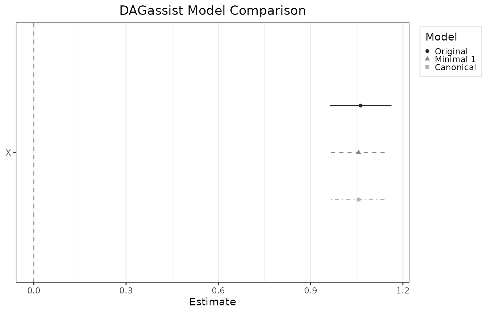

# DAGassist in 10 minutes

## What you’ll learn

- How to go from a `dagitty` DAG + formula to a compact report
- How to interpret the report, and what the variable categories and
  comparison models mean
- How to export to `LaTeX` / `Word` / `Excel` / `text`

### Load packages

``` r
library(DAGassist)
# load helper libraries
library(modelsummary)
library(dagitty)
```

### Make your DAG and data

``` r
n <- 500
Z <- rnorm(n)
A <- rnorm(n)
X <- 0.6*Z + rnorm(n)
M <- 0.5*X + 0.3*Z + rnorm(n)
Y <- 1.0*X + 0.0*M + 0.5*Z + rnorm(n)
df <- data.frame(Y, X, M, Z, A)

dag_model <- dagitty('
  dag {
    Z -> X
    Z -> Y
    A -> Y
    X -> M
    X -> Y
    M -> Y
    X [exposure]
    Y [outcome]
  }')
```

### Generate a console report with `DAGassist`

See the [Getting
Started](https://grahamgoff.github.io/DAGassist/articles/get-started.html)
vignette for a guide on using different parameters get the most out of
DAGassist. For the purpose of this tutorial, we will keep it simple.

See the [Supported
Models](https://grahamgoff.github.io/DAGassist/articles/compatibility.html)
vignette for documentation on what engines `DAGassist` supports. Since
`DAGassist` is model-agnostic, if an engine accepts a standard
`formula + data` interface, it will usually work.

**Interpreting the output:**

- **ROLES:** `DAGassist` classifies the variables in your formula by
  causal role, based on the relationships in your DAG. It classifies
  according to these categories.
  - **X** is the `treatment` / `independent variable` / `exposure`.
  - **Y** is the `outcome` / `dependent variable`.
  - **conf** stands for `confounder`, a common cause of X and Y.
    Confounders create a spurious association between X and Y, and must
    be adjusted for.
  - **med** stands for `mediator`, a variable that lies on a path from X
    to Y, which transmit some of the effect from X to Y. One should not
    adjust for mediators if one wants to estimate the total effect of X
    on Y.
  - **col** stands for `collider`, a direct common descendant of X
    and Y. Colliders already block paths, so adjusting for it opens a
    spurious association between X and Y.
  - **IO** stands for `intermediate outcome`, a descendant of Y, which
    introduces bias if adjusted for.
  - **dMed / Dmediator** stands for `descendant of a mediator`, which
    should not be adjusted for when estimating total effect.
  - **dCol / Dcollider** stands for `descendant of a collider`.
    Adjusting for a descendant of a collider opens a spurious
    association between X and Y.
  - **other** variables, such as those that only affect the outcome, do
    not fit any of the previous definitions. They are included in the
    canonical model because they can be safely included as controls, but
    are omitted from the minimal model because their inclusion is not
    strictly necessary. Since `other` variables’ effects are generally
    neutral, it is usually best to use the minimal adjustment set as
    your baseline model.
- **MODEL COMPARISON:**
- `Minimal` is the smallest adjustment set necessary to close all
  back-door paths from the independent to the dependent variable. The
  minimal set only includes `confounders` as controls.
- `Canonical` is the largest permissible adjustment set. Essentially,
  the `canonical` set contains all control variables that are not
  `confounders`, `mediators`, `intermediate outcomes`,
  `descendants of mediatiors`, or `descendants of colliders`.

``` r

DAGassist(
  dag = dag_model,
  formula = lm(Y ~ X + M + Z + A, data = df)
)
#> DAGassist Report: 
#> 
#> Roles:
#> variable  role        Exp.  Out.  conf  med  col  dOut  dMed  dCol  dConfOn  dConfOff  NCT  NCO
#> X         exposure    x                                                                        
#> Y         outcome           x                                                                  
#> Z         confounder              x                                                            
#> M         mediator                      x                                                      
#> A         nco                                                                               x  
#> 
#>  (!) Bad controls in your formula: {M}
#> Minimal controls 1: {Z}
#> Canonical controls: {A, Z}
#> 
#> Formulas:
#>   original:  Y ~ X + M + Z + A
#> 
#> Model comparison:
#> 
#> +----------+----------+-----------+-----------+
#> |          | Original | Minimal 1 | Canonical |
#> +==========+==========+===========+===========+
#> | X        | 1.063*** | 1.056***  | 1.056***  |
#> +----------+----------+-----------+-----------+
#> |          | (0.051)  | (0.046)   | (0.046)   |
#> +----------+----------+-----------+-----------+
#> | M        | -0.015   |           |           |
#> +----------+----------+-----------+-----------+
#> |          | (0.047)  |           |           |
#> +----------+----------+-----------+-----------+
#> | Z        | 0.456*** | 0.451***  | 0.451***  |
#> +----------+----------+-----------+-----------+
#> |          | (0.055)  | (0.053)   | (0.053)   |
#> +----------+----------+-----------+-----------+
#> | A        | 0.007    |           | 0.007     |
#> +----------+----------+-----------+-----------+
#> |          | (0.046)  |           | (0.046)   |
#> +----------+----------+-----------+-----------+
#> | Num.Obs. | 500      | 500       | 500       |
#> +----------+----------+-----------+-----------+
#> | R2       | 0.714    | 0.714     | 0.714     |
#> +==========+==========+===========+===========+
#> | + p < 0.1, * p < 0.05, ** p < 0.01, *** p   |
#> | < 0.001                                     |
#> +==========+==========+===========+===========+ 
#> 
#> Roles legend: Exp. = exposure; Out. = outcome; CON = confounder; MED = mediator; COL = collider; dOut = descendant of outcome; dMed  = descendant of mediator; dCol = descendant of collider; dConfOn = descendant of a confounder on a back-door path; dConfOff = descendant of a confounder off a back-door path; NCT = neutral control on treatment; NCO = neutral control on outcome
```

### Exporting

See the [Making
Reports](https://grahamgoff.github.io/DAGassist/articles/making-reports.html)
vignette for more detailed information on producing publication-quality
`DAGassist` reports in `LaTex`, `Word`, `Excel`, and `plaintext`.

Since `DAGassist` is designed to make appendix robustness checks, this
is an example of how to output a report in `LaTeX`.

``` r
#initialize a temporary path
out_tex <- file.path(tempdir(), "dagassist_report.tex")

DAGassist(
  dag = dag_model,
  formula = lm(Y ~ X + M + Z + A, data = df),
  type = "latex", 
  out = out_tex) #put your output directory and file name here

cat(readLines(out_tex, n = 15), sep = "\n") # briefly show the output
#> % --------------------- DAGassist LaTeX fragment ---------------------
#> % Requires: \usepackage{tabularray} \UseTblrLibrary{booktabs,siunitx,talltblr}
#> \begingroup\footnotesize
#> \begingroup\setlength{\emergencystretch}{3em}
#> % needs \usepackage{graphicx} for \rotatebox
#> \begin{longtblr}[presep=0pt, postsep=0pt, caption={DAGassist Report:}, label={tab:dagassist}]%
#> {width=\textwidth,colsep=1.5pt,rowsep=0pt,abovesep=0pt,belowsep=0pt,column{3}={colsep=6pt},colspec={X[35,l]X[15,l]X[8,c]X[8,c]X[8,c]X[8,c]X[8,c]X[8,c]X[8,c]X[8,c]X[8,c]X[8,c]X[8,c]X[8,c]}}
#> \toprule
#> Variable & Role & \rotatebox[origin=c]{60}{Exp.} & \rotatebox[origin=c]{60}{Out.} & \rotatebox[origin=c]{60}{CON} & \rotatebox[origin=c]{60}{MED} & \rotatebox[origin=c]{60}{COL} & \rotatebox[origin=c]{60}{dOut} & \rotatebox[origin=c]{60}{dMed} & \rotatebox[origin=c]{60}{dCol} & \rotatebox[origin=c]{60}{dConfOn} & \rotatebox[origin=c]{60}{dConfOff} & \rotatebox[origin=c]{60}{NCT} & \rotatebox[origin=c]{60}{NCO} \\
#> \midrule
#> A & nco &  &  &  &  &  &  &  &  &  &  &  & x \\
#> M & mediator &  &  &  & x &  &  &  &  &  &  &  &  \\
#> X & exposure & x &  &  &  &  &  &  &  &  &  &  &  \\
#> Y & outcome &  & x &  &  &  &  &  &  &  &  &  &  \\
#> Z & confounder &  &  & x &  &  &  &  &  &  &  &  &  \\
```

Optionally, users can generate visual output via dotwhisker plots:

``` r
DAGassist(dag = dag_model,
          formula = lm(Y ~ X + M + Z + A, data = df),
          type = "dotwhisker")
```


